<div align="center" id="top"> 
  &#xa0;

  <!-- <a href="https://architecture_webservice_system.netlify.app">Demo</a> -->
</div>

<h1 align="center">Learning Management Platform (Prototype of Canvas by Instructure) </h1>

<h1> Peer Evaluation </h1>
Nguyen Khang Duy: s3636076 [Frontend Messaging, MVC BackendPostgre, MVC BackendRedis, Connection Cache Lazy Loading Architecture, System Diagrams Design, Class Diagrams Design, Jmeter Load Testing, Dockerize]<br>
Tran Dam Quan: s3678708 [Frontend Login/Register access backend loginAPI, Frontend Homepage, Frontend Course, Frontend Messaging, Dockerize]<br>
Pham Nguyen Thanh Nhan: s3563953 [Frontend Homepage, Frontend Course, System Diagrams Design, Dockerize]<br>
Vu Duy Khoi: s3694615 [MVC BackendRedis, Connection Cache Lazy Loading Architecture, Class Diagrams Design, Dockerize]<br>
Ha Minh Hieu: s3694960 [MVC BackendPostgre, AWS deployment, Database API Generating, Postman APIRequest Testing, Class Diagrams Design, Dockerize]<br>
## :dart: About ##

The application is an end-to-end prototype of the Canvas platform, a Learning Management System created by Instructure (https://www.instructure.com/canvas). It supports majority of functionalities presented by the actual website such as registration by a student or a faculty, creation of courses by a faculty, enrolling into courses by a student, adding assignments/quizzes, taking quizzes, grading, chatbot messaging for query, pdf document view, real-time notifications, and so on. The application is developed majorly using the MERN stack technologies ( ReactJS, Spring Boot , Docker, Redis) and is made highly scalable and available using the 3-tier distributed system paradigm with fault tolerance and load balancing using the AWS EC2  with real-time data pipelining. The Backend is a RESTful service that handles all the requests from the client.
Github Link: https://github.com/nguyenkhangduy298/Architecture_webservice_system


## :sparkles: Features ##

:heavy_check_mark: Instructure canvas base on RMIT canvas;\
:heavy_check_mark: chatbox for user;


## System Architecture ##
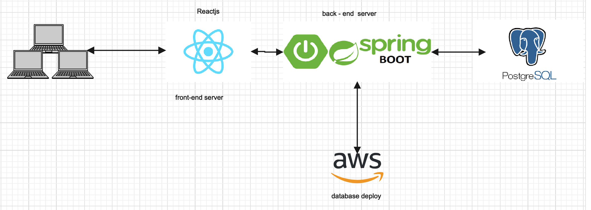
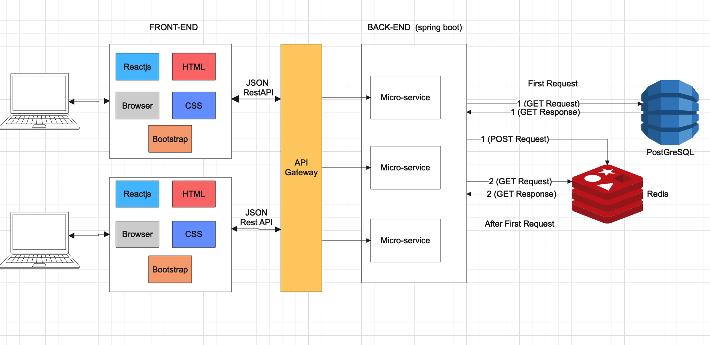

## Class Diagram ##


 ## :snake: Python Intepreter - User/Book Generator ##
This python code will help generate numbers of dummies data for testing
Located in *RandomGenerator* folder

# Python Prerequisite #
Run these command inside RandomGenerator folder
```bash
$ python3 -m pip install json
$ python3 -m pip install requests

```
## Random user API link ##
* Random user: https://randomuser.me/api/
* Random books: https://api.airtable.com/v0/appybL1OJaEEIvAdS/Books?api_key=keymAugpaEvXsyGBr

## How to run ##
```bash
# Run random book generator
# --get 1 means get 100 records in the randomuser.me
$ python3 bookGenerator.py --get 1

# Post it to localhost:8080/book
$ python3 bookGenerator.py --post run

# Post number of users onto localhost:8080/user
# Which --post 'number of user'
$ python3 userGenerator.py --post 100
```

## API tester ##
* In the folder, there is *architect_rmit.postman_collection.json* file
* How to test API:
    * Run MessagingBackendRedis for service
    * Go to Postman
    * Import the *architect_rmit.postman_collection.json* file
    * Run through all APIs
    * If it all return code 200, the API is correct!!

## :rocket: Technologies ##

The following tools were used in this project:

- [React](https://pt-br.reactjs.org/)
- [TypeScript](https://www.typescriptlang.org/)
- [Aws](Deployment into the system with personal public IP + pem.file using ubuntu, zip file and scp into aws for deployment)
- [Sringboots](MVC)
- [Redis](Cache Lazy Loading- NoSQL)
- [Postgre](SQL)


## :white_check_mark: Requirements ##

Before starting :checkered_flag:, you need to have [Git](https://git-scm.com) and [Node](https://nodejs.org/en/) installed.

## Build instruction to run the project on local host ##

- Install Backend and Frontend dependencies.- Install Backend and Frontend dependencies.
- Do command "mvn clean install" for "MessagingBackendPostgre" and "MessagingBackendRedis"
- Do command "docker-compose & docker-compose up" for main project "Architecture_webservice_system". This will run the whole project.
- Do run "SpringBootApplication" for "MessagingBackendPostgre"
- Now you can access to localhost:3000 to experience the web application.

** Note **: In case you test Redis API with Postman and it returns error. Please run "MessagingBackendRedis" manually with Spring Boot


## The UI show ##

- In the first page will show the login page 
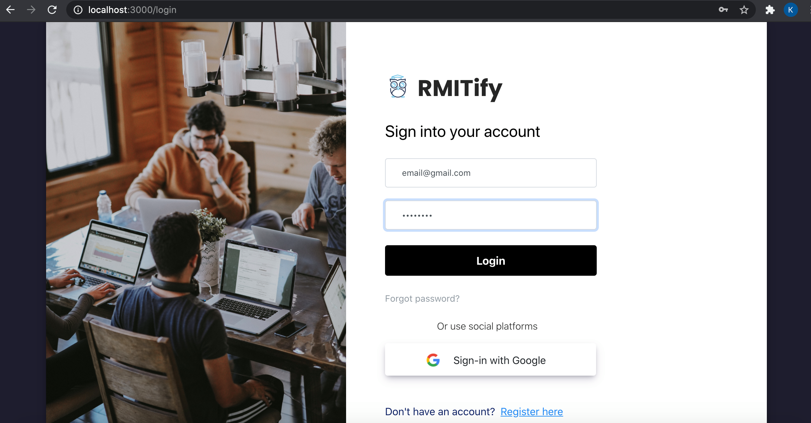
- if you do not have account you need to register 
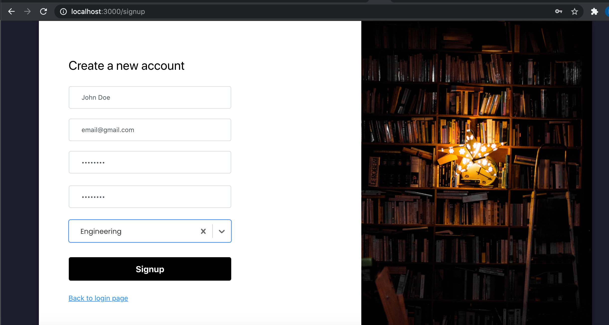 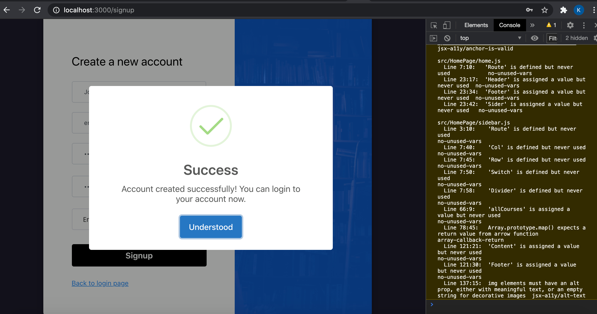

## Main Feature ##
Type anything with "Book" in the chatbot, the system will load from database and post to redis. For other cases, the chatbot will have its own resolving cases.
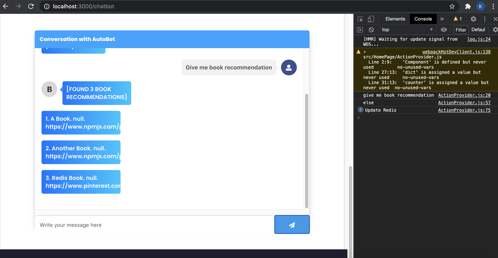 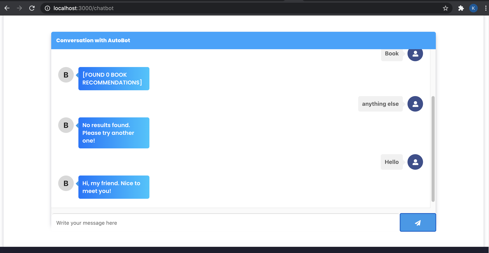
THE AUTO GENERATING BOOK DATABASE IS USED WITH MORE THAN 1000 DATA, THE CHATBOT LOADING WILL BE SLOW BUT THE PROCESS WILL EVENTUALLY SHOW ALL QUERY RESULTS
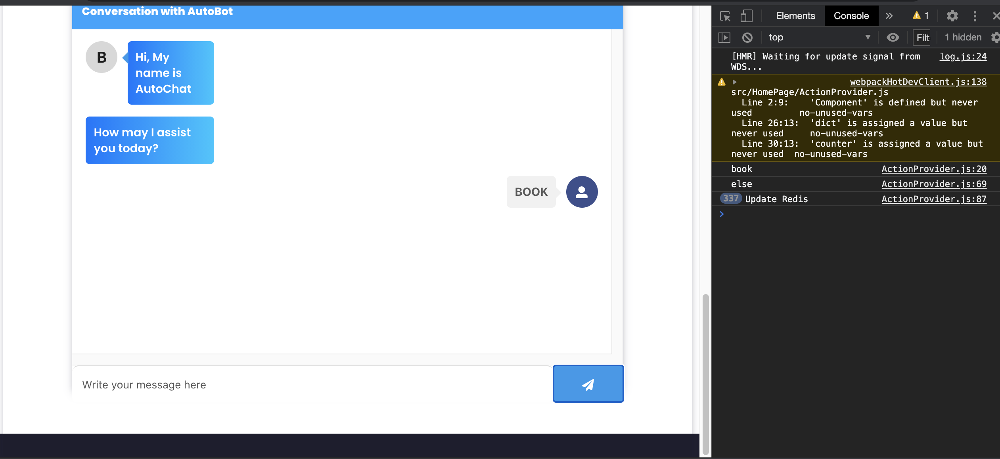 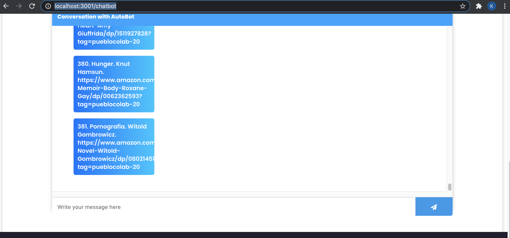

## JMeter Load Testing ##
Jmeter Load Testing with 1000 concurrent requests
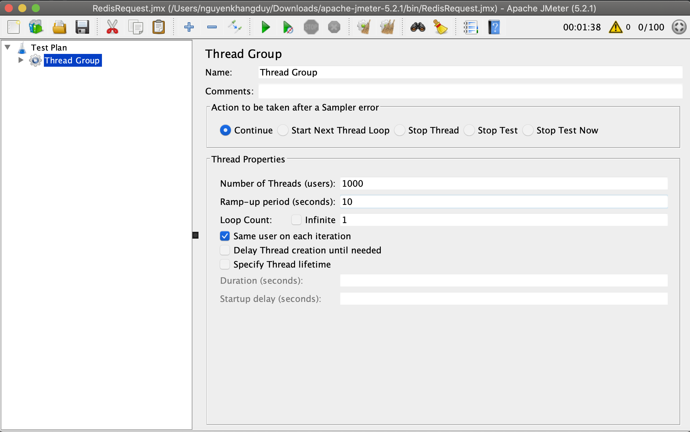 
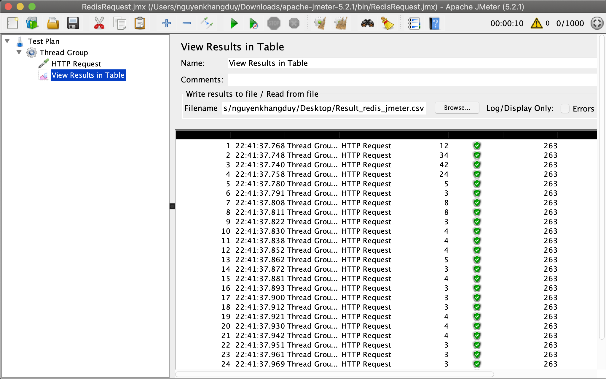
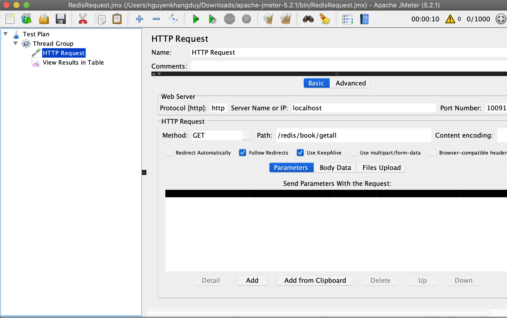
The result file is generated in Result_redis_jmeter.csv file

<a href="#top">Back to top</a>
