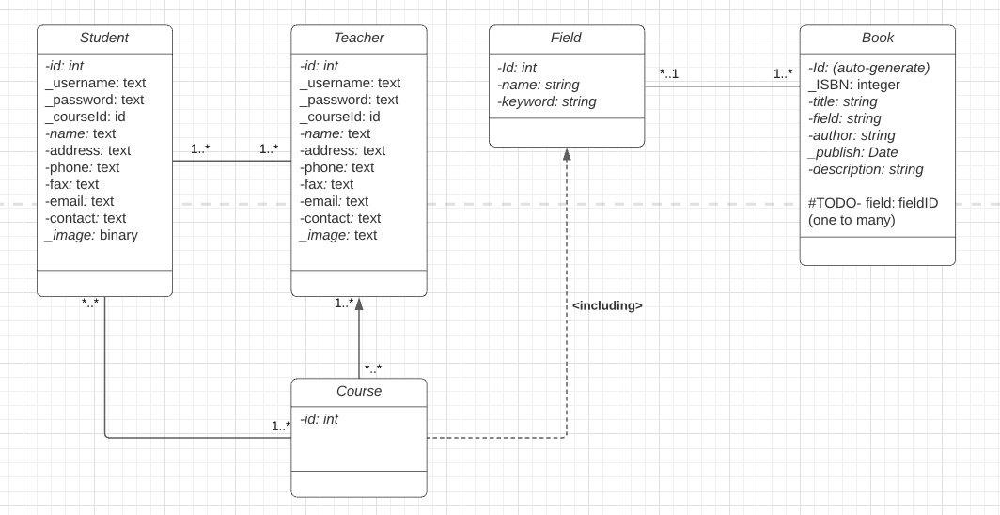

 
  

  &#xa0;

  <!-- <a href="https://architecture_webservice_system.netlify.app">Demo</a> -->

<h1 align="center">Learning Management Platform (Prototype of Canvas by Instructure) </h1>

  

  

  

  

  <!--  -->

  <!--  -->

  <!--  -->

<!-- Status -->

<!-- <h4 align="center"> 
	🚧  Architecture_webservice_system 🚀 Under construction...  🚧
</h4> 

 -->

  <a href="#dart-about">About</a> &#xa0; | &#xa0; 
  <a href="#sparkles-features">Features</a> &#xa0; | &#xa0;
  <a href="#rocket-technologies">Technologies</a> &#xa0; | &#xa0;
  <a href="#white_check_mark-requirements">Requirements</a> &#xa0; | &#xa0;
  <a href="#checkered_flag-starting">Starting</a> &#xa0; | &#xa0;
  <a href="#memo-license">License</a> &#xa0; | &#xa0;
  <a href="https://github.com/{{YOUR_GITHUB_USERNAME}}" target="_blank">Author</a>

 

## :dart: About ##

The application is an end-to-end prototype of the Canvas platform, a Learning Management System created by Instructure (https://www.instructure.com/canvas). It supports majority of functionalities presented by the actual website such as registration by a student or a faculty, creation of courses by a faculty, enrolling into courses by a student, adding assignments/quizzes, taking quizzes, grading, P2P messaging, pdf document view, real-time notifications, and so on. The application is developed majorly using the MERN stack technologies ( ReactJS, Spring Boot , Docker, Redis) and is made highly scalable and available using the 3-tier distributed system paradigm with fault tolerance and load balancing using the AWS EC2  with real-time data pipelining. The Backend is a RESTful service that handles all the requests from the client.

## :sparkles: Features ##

:heavy_check_mark: Feature 1;\
:heavy_check_mark: Feature 2;\
:heavy_check_mark: Feature 3;

## System Architecture ##

## Class Diagram ##

## :rocket: Technologies ##

The following tools were used in this project:

- [Expo](https://expo.io/)
- [Node.js](https://nodejs.org/en/)
- [React](https://pt-br.reactjs.org/)
- [React Native](https://reactnative.dev/)
- [TypeScript](https://www.typescriptlang.org/)

## :white_check_mark: Requirements ##

Before starting :checkered_flag:, you need to have [Git](https://git-scm.com) and [Node](https://nodejs.org/en/) installed.

## Build instruction to run the project on local host ##

<a href="#top">Back to top</a>
